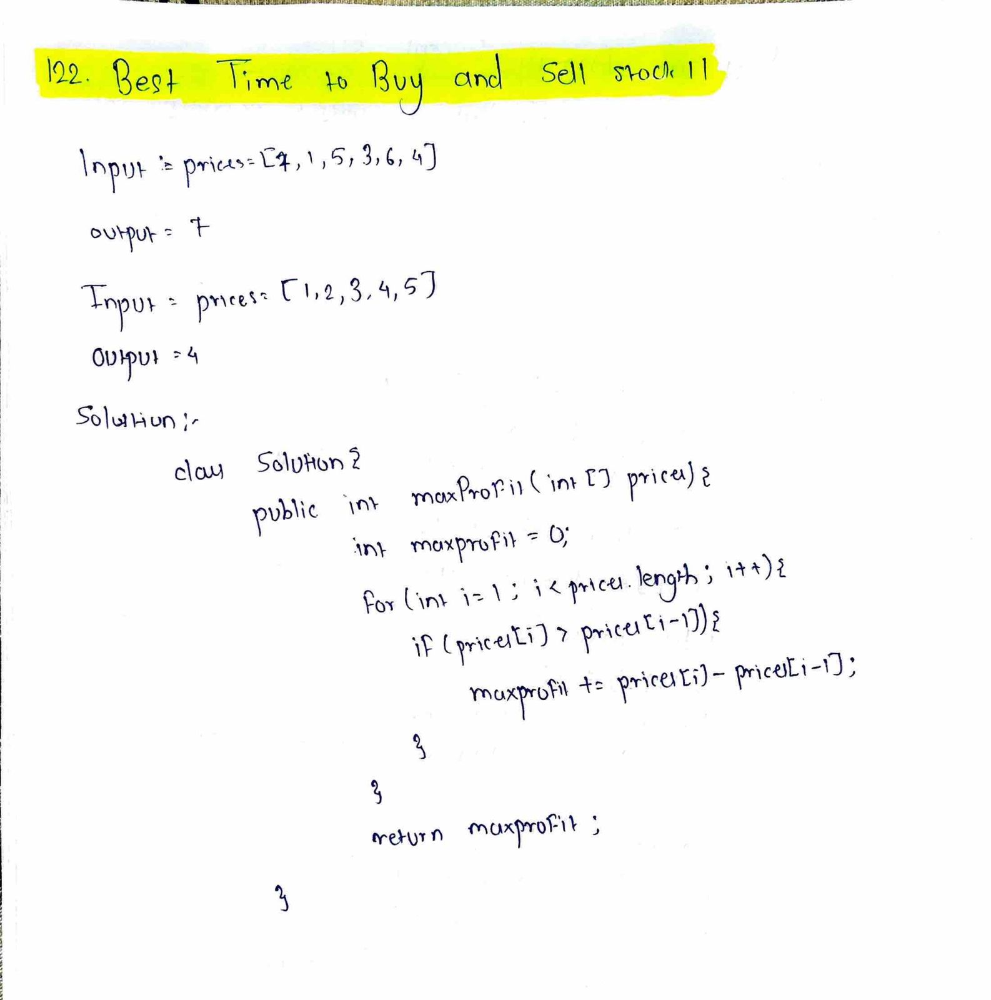

# LeetCode 122 – Best Time to Buy and Sell Stock II

**Difficulty:** Medium  
**Topic:** Array, Greedy  

## Problem Statement
You are given an integer array `prices` where `prices[i]` is the price of a given stock on the `i`-th day.

On each day, you may decide to **buy and/or sell** the stock.  
You can hold **at most one share** of the stock at any time.

You are allowed to complete **multiple transactions**, but you must sell the stock before buying again.

Return the **maximum profit** you can achieve.

---

## Approach
- Traverse the price array from the second day
- If today’s price is **greater than yesterday’s price**:
  - Add the difference to the total profit
- This captures profit from **every increasing price segment**
- Since unlimited transactions are allowed, summing all positive differences gives the maximum profit

---

## Algorithm
1. Initialize `maxprofit = 0`
2. Loop from index `1` to `prices.length - 1`
3. If `prices[i] > prices[i - 1]`
   - Add `prices[i] - prices[i - 1]` to `maxprofit`
4. Return `maxprofit`

---

## Complexity
- **Time Complexity:** O(n)
- **Space Complexity:** O(1)

---

## Code
See `solution.java`

---

## Handwritten Notes

