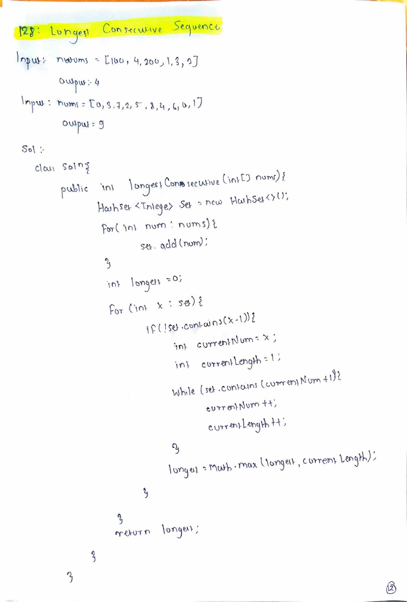

# Longest Consecutive Sequence

## Difficulty
Medium

## Topic
Array, HashSet

## Problem Statement
You are given an unsorted array of integers `nums`.

A consecutive sequence is a sequence of numbers in which each number differs from the previous one by exactly `1`.

The elements of the sequence do not need to be contiguous in the array.

Write a program to return the length of the longest consecutive elements sequence.

You must write an algorithm that runs in **O(n)** time.

---

## Examples

### Example 1

**Input:**

nums = [100, 4, 200, 1, 3, 2]

**Output:**

4

---

### Example 2

**Input:**

nums = [0,3,7,2,5,8,4,6,0,1]

**Output:**

9

---

## Key Insight
A number can only be considered the start of a consecutive sequence if the number immediately before it does not exist in the array.

---

## Approach
1. Store all elements in a hash-based data structure for fast lookup.
2. Iterate through each unique element.
3. Start counting a sequence only when the previous number is absent.
4. Expand the sequence in the forward direction.
5. Track the maximum sequence length.

---

## Algorithm
1. Insert all numbers into a set.
2. For each number `x` in the set:
   - If `x - 1` does not exist, treat `x` as the start.
   - Count consecutive numbers starting from `x + 1`.
3. Update the maximum length found.
4. Return the maximum length.

---

## Complexity
- **Time Complexity:** O(n)
- **Space Complexity:** O(n)

---

## Handwritten Notes

