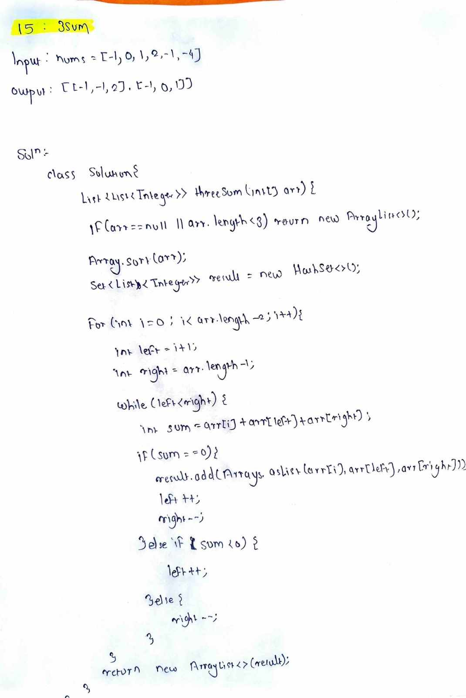

# LeetCode 15 – 3Sum

**Difficulty:** Medium  
**Topic:** Array, Two Pointers, Sorting  

---

## Problem Statement
Given an integer array `nums`, return **all the unique triplets** `[nums[i], nums[j], nums[k]]` such that:

- `i != j`, `i != k`, and `j != k`
- `nums[i] + nums[j] + nums[k] == 0`

The solution set must **not contain duplicate triplets**.  
Return the result in **any order**.

---

## Example

### Input
**nums array:**

| Index | Value |
|------:|------:|
| 0 | -1 |
| 1 | 0 |
| 2 | 1 |
| 3 | 2 |
| 4 | -1 |
| 5 | -4 |

### Output
| Triplets |
|---------|
| [-1, -1, 2] |
| [-1, 0, 1] |

---

## Approach
- Sort the array to simplify duplicate handling
- Fix one element and reduce the problem to a 2-sum scenario
- Use two pointers to find valid pairs
- Skip duplicate values to ensure unique triplets

---

## Complexity
- **Time Complexity:** `O(n²)`
- **Space Complexity:** `O(1)` (excluding output)

---

## Code
See `solution.java`

---

## Handwritten Notes

