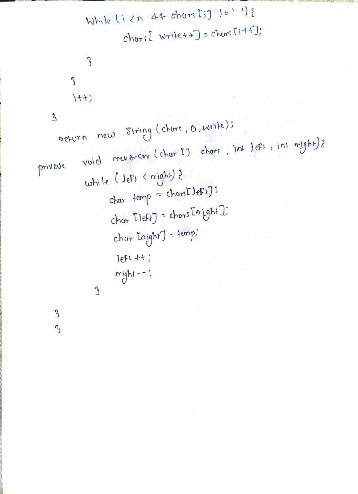

# LeetCode 151 – Reverse Words in a String

**Difficulty:** Medium  
**Topic:** String, Two Pointers  

---

## Problem Statement
Given an input string `s`, reverse the order of the **words**.

A word is defined as a sequence of non-space characters.  
The words in `s` will be separated by at least one space.

Return a string of the words in **reverse order**, joined by a **single space**.

---

## Approach
- Remove leading and trailing spaces from the string
- Split the string by one or more spaces to extract words
- Reverse the order of the words
- Join the words using a single space

This ensures:
- No extra spaces
- Correct word order

---

## Algorithm
1. Trim the input string `s`
2. Split the string using `"\\s+"` to handle multiple spaces
3. Reverse the array of words
4. Join the reversed words with a single space
5. Return the final string

---

## Complexity
- **Time:** O(n)  
- **Space:** O(n)

---

## Code
See `solution.java`

---

## Handwritten Notes

