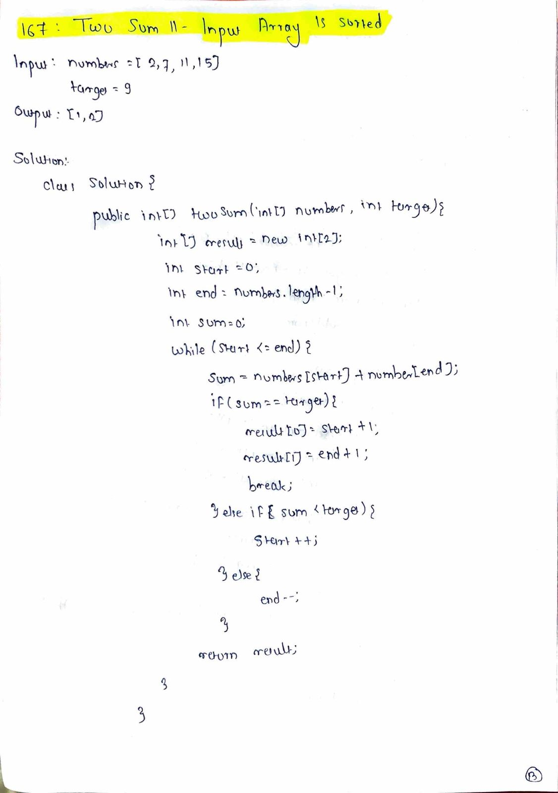

# Managers with at Least 5 Direct Reports

## Difficulty
Medium

## Topic
SQL, GROUP BY, HAVING, Aggregation

## Problem Statement
Table: `Employee`

| Column Name | Type    |
|-------------|---------|
| id          | int     |
| name        | varchar |
| managerId   | int     |

`id` is the primary key for this table.  
Each row of this table indicates the name of an employee and their manager.  
If `managerId` is `NULL`, then the employee does not have a manager.

Write a SQL query to find the **names of managers** who have **at least 5 direct reports**.

Return the result table in **any order**.

---

## Examples

### Example 1

**Input:**

Employee table:

| id | name | managerId |
|----|------|-----------|
| 1  | A    | NULL      |
| 2  | B    | 1         |
| 3  | C    | 1         |
| 4  | D    | 1         |
| 5  | E    | 1         |
| 6  | F    | 1         |

**Output:**

| name |
|------|
| A    |

---

## Key Insight
Managers are employees whose `id` appears multiple times in the `managerId` column.  
The number of such occurrences represents how many direct reports a manager has.

---

## Approach
1. Analyze how direct reporting relationships are stored.
2. Count how many employees report to each manager.
3. Identify managers who meet the minimum report requirement.
4. Retrieve only the manager names.

---

## Algorithm
1. Examine the `managerId` column to identify reporting relationships.
2. Aggregate employees based on their manager.
3. Apply a condition to select managers with sufficient reports.
4. Output the corresponding manager names.

---

## Complexity
- **Time Complexity:** O(n)
- **Space Complexity:** O(1)

---

## Handwritten Notes

