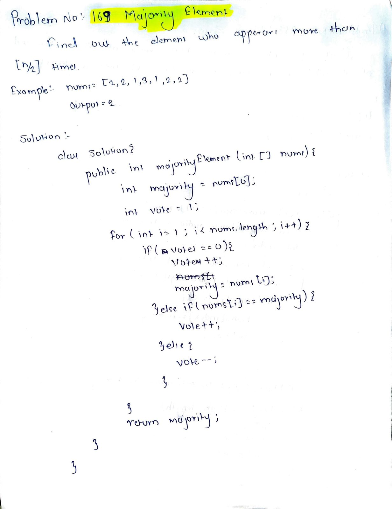

# LeetCode 169 – Majority Element

**Difficulty:** Easy  
**Topic:** Array, Voting Algorithm  

## Problem Statement
Given an array `nums` of size `n`, return the **majority element**.

The majority element is the element that appears **more than ⌊n / 2⌋ times**.  
You may assume that the majority element always exists in the array.

## Approach
- Use the **Boyer–Moore Voting Algorithm**
- Maintain a `candidate` and a `count`
- When `count` becomes `0`, select the current element as the new candidate
- Increment `count` if the current element matches the candidate
- Decrement `count` otherwise
- The final candidate is the majority element

## Complexity
- Time: O(n)
- Space: O(1)

## Code
See `solution.java`

## Handwritten Notes

