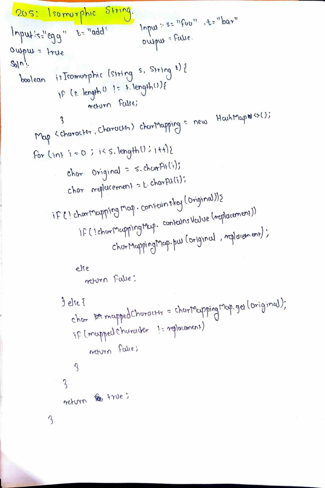

# LeetCode 205 – Isomorphic Strings

**Difficulty:** Easy  
**Topic:** HashMap, String  

---

## Problem Statement
Given two strings `s` and `t`, determine if they are **isomorphic**.

Two strings are isomorphic if the characters in `s` can be replaced to get `t`.

- All occurrences of a character must be replaced with another character while preserving the order.
- No two characters may map to the same character, but a character may map to itself.

---

## Examples

### Example 1
**Input:**  
`s = "egg", t = "add"`

**Output:**  
`true`

### Example 2
**Input:**  
`s = "foo", t = "bar"`

**Output:**  
`false`

### Example 3
**Input:**  
`s = "paper", t = "title"`

**Output:**  
`true`

---

## Key Insight
To ensure strings are isomorphic:
- Each character in `s` must map to **only one** character in `t`
- No two characters in `s` can map to the **same** character in `t`

This requires maintaining a **bidirectional mapping**.

---

## Approach
- If lengths of `s` and `t` are different, return `false`
- Use two hash maps:
  - One for mapping `s → t`
  - One for mapping `t → s`
- Traverse both strings character by character
- Validate mappings in both directions
- If any mismatch occurs, return `false`

---

## Algorithm
1. If `s.length() != t.length()`, return `false`
2. Initialize two maps:
   - `mapST` for `s → t`
   - `mapTS` for `t → s`
3. Loop through characters of `s` and `t`
4. Check:
   - If `mapST` already maps incorrectly → return `false`
   - If `mapTS` already maps incorrectly → return `false`
5. Insert mappings into both maps
6. Return `true` after successful traversal

---

## Complexity
- **Time Complexity:** O(n)
- **Space Complexity:** O(n)

---

## Code
See `solution.java`

---

## Handwritten Notes

