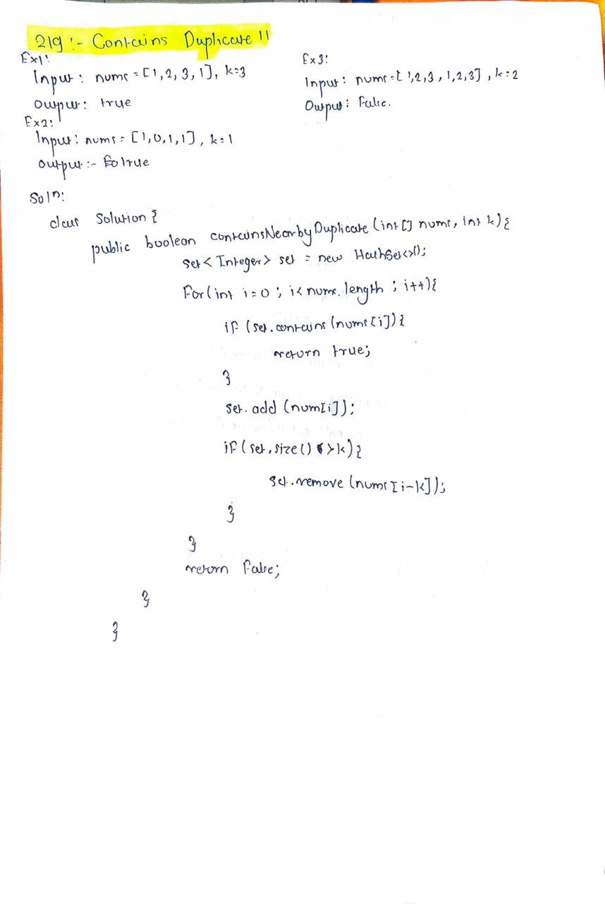

# LeetCode 219 – Contains Duplicate II

**Difficulty:** Easy  
**Topic:** Array, HashSet, Sliding Window  

---

## Problem Statement
You are given an integer array `nums` and an integer `k`.

Return `true` if there are **two distinct indices** `i` and `j` such that:
- `nums[i] == nums[j]`
- the absolute difference between `i` and `j` is **at most `k`**

Otherwise, return `false`.

---

## Key Insight
The problem is not just about finding duplicates, but about finding duplicates that occur **within a limited distance**.  
This can be handled by remembering only the **last `k` elements** seen so far while traversing the array.

---

## Approach
- Traverse the array from left to right
- Maintain a logical window of the **last `k` elements**
- If the current element already exists in this window, a valid duplicate is found
- As the window moves forward, remove elements that fall outside the `k` distance

---

## Algorithm
1. Traverse the array element by element
2. Check whether the current element already exists in the recent window
3. If yes, return `true`
4. Otherwise, include the element in the window
5. Remove elements that are more than `k` positions behind
6. If no valid duplicate is found, return `false`

---

## Complexity
- **Time Complexity:** O(n)
- **Space Complexity:** O(k)

---

## Handwritten Notes

