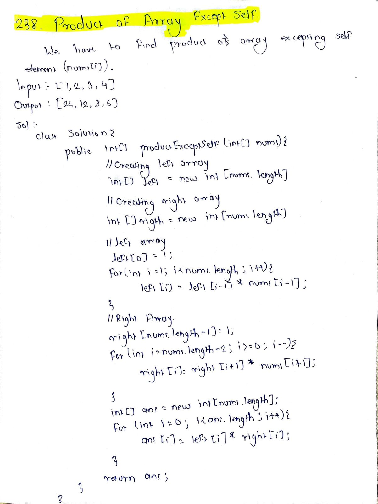

# LeetCode 238 – Product of Array Except Self

**Difficulty:** Medium  
**Topic:** Array, Prefix Product  

## Problem Statement
Given an integer array `nums`, return an array `answer` such that  
`answer[i]` is the product of all elements of `nums` except `nums[i]`.

The solution must run in **O(n)** time and **without using division**.

## Approach
- Traverse the array from left to right to calculate prefix products
- Store the product of all elements before the current index
- Traverse from right to left to multiply with suffix products
- This avoids division and handles zero values correctly

## Complexity
- Time: O(n)
- Space: O(1)

## Code
See `solution.java`

## Handwritten Notes

