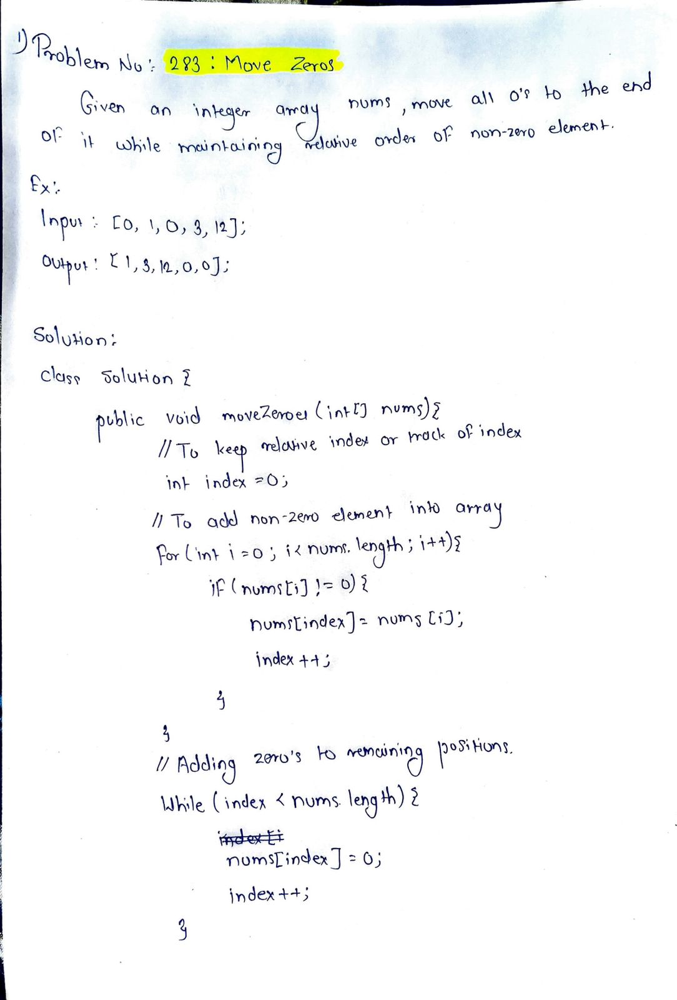

# LeetCode 283 – Move Zeroes

**Difficulty:** Easy  
**Topic:** Array, Two Pointers  

## Problem Statement
Move all `0`s to the end of the array while maintaining the relative order of non-zero elements.  
The operation must be done **in-place**.

## Approach
- Use a pointer `k` to track the position of non-zero elements
- Traverse the array and place non-zero elements at index `k`
- Fill remaining positions with `0`

## Complexity
- Time: O(n)
- Space: O(1)

## Code
See `solution.java`

## Handwritten Notes

