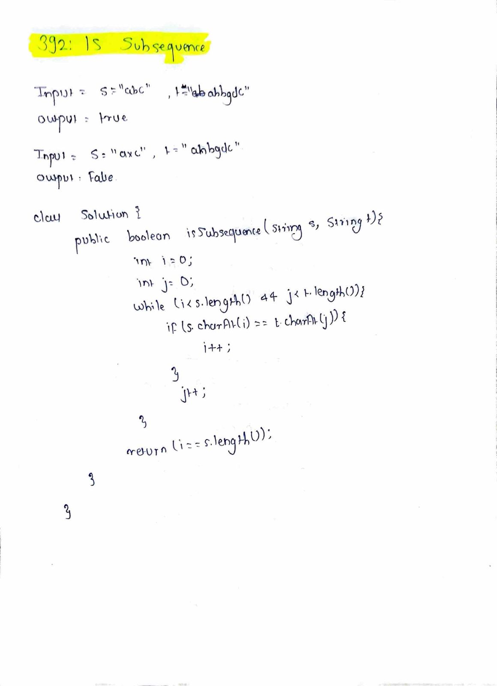

# LeetCode 392 – Is Subsequence

**Difficulty:** Easy  
**Topic:** Two Pointers, String  

---

## Problem Statement
Given two strings `s` and `t`, return `true` if `s` is a **subsequence** of `t`, or `false` otherwise.

A subsequence of a string is formed by deleting some (or none) of the characters from the original string **without changing the relative order** of the remaining characters.

---

## Example 1
**Input:**  
`s = "abc", t = "ahbgdc"`

**Output:**  
`true`

---

## Example 2
**Input:**  
`s = "axc", t = "ahbgdc"`

**Output:**  
`false`

---

## Key Insight
- The relative order of characters in `s` must be preserved in `t`
- Characters do **not** need to be contiguous
- Using two pointers allows us to efficiently track matching characters without extra space

---

## Approach (Two Pointers)
1. Use two pointers:
   - Pointer `i` for string `s`
   - Pointer `j` for string `t`
2. Traverse both strings simultaneously
3. If characters at `i` and `j` match:
   - Move pointer `i`
4. Always move pointer `j`
5. At the end, if `i` reaches the length of `s`, all characters were matched in order

---

## Algorithm
1. Initialize `i = 0`, `j = 0`
2. While `i < s.length()` and `j < t.length()`:
   - If `s.charAt(i) == t.charAt(j)`, increment `i`
   - Increment `j`
3. If `i == s.length()`, return `true`
4. Otherwise, return `false`

---

## Complexity
- **Time Complexity:** `O(n)`  
  (where `n` is the length of string `t`)
- **Space Complexity:** `O(1)`

---

## Code
See `solution.java`

---

## Handwritten Notes

