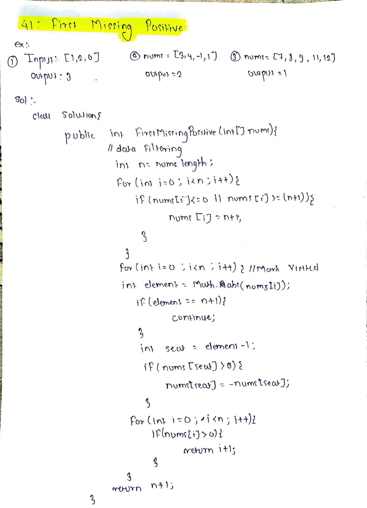

# LeetCode 41 – First Missing Positive

**Difficulty:** Hard  
**Topic:** Array, In-place, Hashing  

---

## Problem Statement
Given an **unsorted integer array** `nums`, return the **smallest missing positive integer**.

You must implement an algorithm that runs in **O(n) time** and uses **O(1) extra space**.

---

## Example 1
**Input:**  
`nums = [1, 2, 0]`  

**Output:**  
`3`

---

## Example 2
**Input:**  
`nums = [3, 4, -1, 1]`  

**Output:**  
`2`

---

## Example 3
**Input:**  
`nums = [7, 8, 9, 11, 12]`  

**Output:**  
`1`

---

## Key Insight
- The smallest missing positive number must lie in the range **[1, n + 1]**, where `n` is the array length.
- Numbers **≤ 0** or **> n** are irrelevant.
- We can use the array indices to **place each number `x` at index `x - 1`**.

---

## Approach (Index Placement / Cyclic Sort)
1. Traverse the array
2. While the current number `x` is in the range `[1, n]` and not already at its correct index:
   - Swap `nums[i]` with `nums[x - 1]`
3. After placement, scan the array:
   - The first index `i` where `nums[i] != i + 1` gives the answer `i + 1`
4. If all positions are correct, return `n + 1`

---

## Algorithm
1. Let `n = nums.length`
2. For each index `i`:
   - While `nums[i]` is valid and misplaced, swap it to its correct position
3. Traverse array again:
   - If `nums[i] != i + 1`, return `i + 1`
4. Return `n + 1`

---

## Complexity
- **Time Complexity:** `O(n)`
- **Space Complexity:** `O(1)`

---

## Code
See `solution.java`

---

## Handwritten Notes

