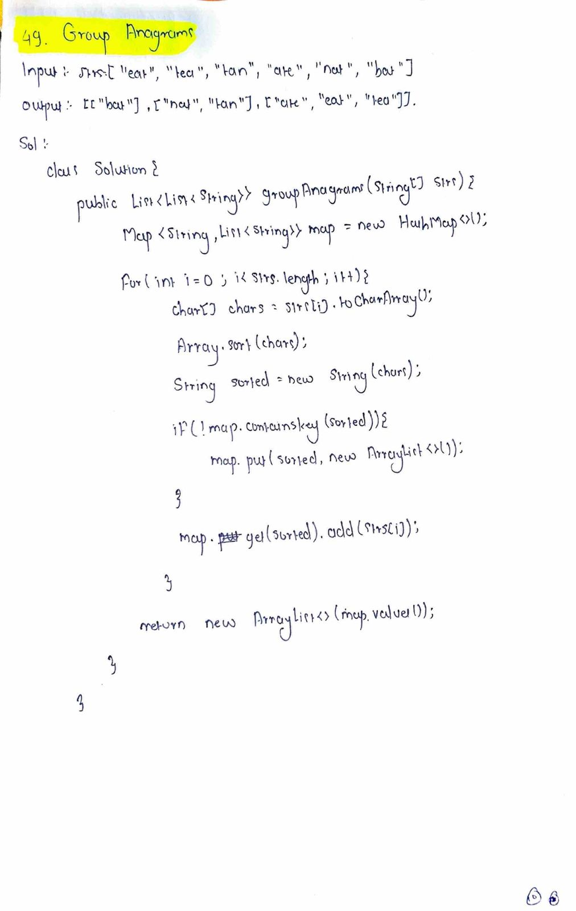

# LeetCode 49 – Group Anagrams

**Difficulty:** Medium  
**Topic:** Java, HashMap, String, Sorting  

---

## Problem Statement
You are given an array of strings `strs`.

Group the strings that are **anagrams** of each other.  
An anagram is a word formed by rearranging the letters of another word, using all original letters exactly once.

The answer can be returned in **any order**.

---

## Example

**Input:**
strs = ["eat","tea","tan","ate","nat","bat"]

**Output:**
[["eat","tea","ate"],["tan","nat"],["bat"]]

---

## Key Insight
- Anagrams have the same characters with the same frequency
- Sorting characters of a string gives a common representation for anagrams
- This representation can be used as a key to group strings

---

## Approach
1. Traverse each string in the array
2. Sort the characters of the string
3. Use the sorted string as a key
4. Group original strings using a HashMap
5. Collect all grouped values

---

## Algorithm
1. Create a HashMap with key as sorted string and value as list of strings
2. For each string:
   - Convert to character array
   - Sort the array
   - Convert back to string
   - Add original string to the map
3. Return all values from the map

---

## Complexity
- **Time Complexity:** O(n × k log k)  
- **Space Complexity:** O(n)

---

## Code
See `solution.java`

---

## Handwritten Notes

