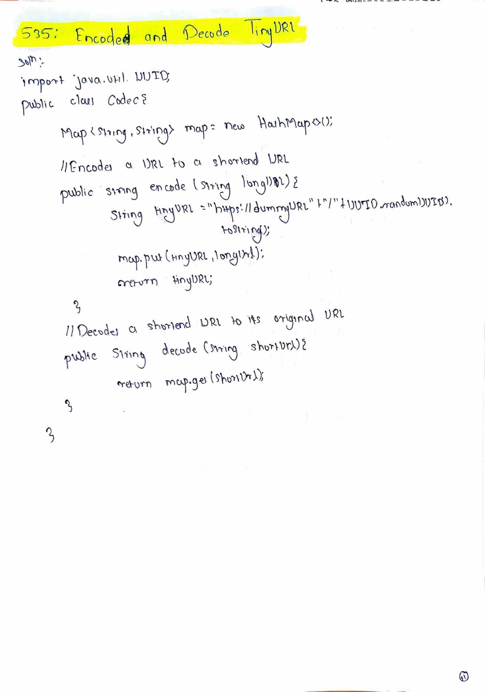

# Encode and Decode TinyURL

**Difficulty:** Medium  
**Topic:** HashMap, Design, String  

---

## Problem Statement
TinyURL is a URL shortening service where a **long URL** is converted into a **short URL** and can later be restored back to the original URL.

Design a class to support the following two methods:

- `encode(String longUrl)`  
  Encodes a URL to a shortened URL.

- `decode(String shortUrl)`  
  Decodes a shortened URL to its original URL.

The implementation should ensure that:

decode(encode(longUrl)) == longUrl

You may assume that the generated short URLs are unique.

---

## Examples

### Input

longUrl = "[https://leetcode.com/problems/design-tinyurl](https://leetcode.com/problems/design-tinyurl)"

### Encode Output

"[http://tinyurl.com/abc123](http://tinyurl.com/abc123)"

### Decode Output

"[https://leetcode.com/problems/design-tinyurl](https://leetcode.com/problems/design-tinyurl)"

---

## Key Insight
A short URL **does not contain enough information** to reconstruct the original URL by computation.  
Therefore, the solution must **store a mapping** between the generated short key and the original long URL.

---

## Approach
- Generate a unique key for each long URL.
- Store the mapping between the key and the long URL.
- Return the short URL formed by concatenating the base URL with the key.
- Decode by extracting the key and performing a lookup.

---

## Algorithm
1. Initialize a HashMap to store key → long URL mappings.
2. While encoding:
   - Generate a unique short key.
   - Store the mapping in the HashMap.
   - Return `baseUrl + key`.
3. While decoding:
   - Extract the key from the short URL.
   - Retrieve and return the original long URL from the HashMap.

---

## Complexity
- **Time Complexity:**  
  - Encode: O(1)  
  - Decode: O(1)
- **Space Complexity:** O(n), where n is the number of URLs stored.

---

## Code Reference
Java

---

## Handwritten Notes

